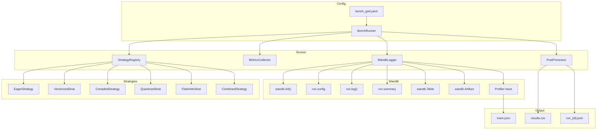
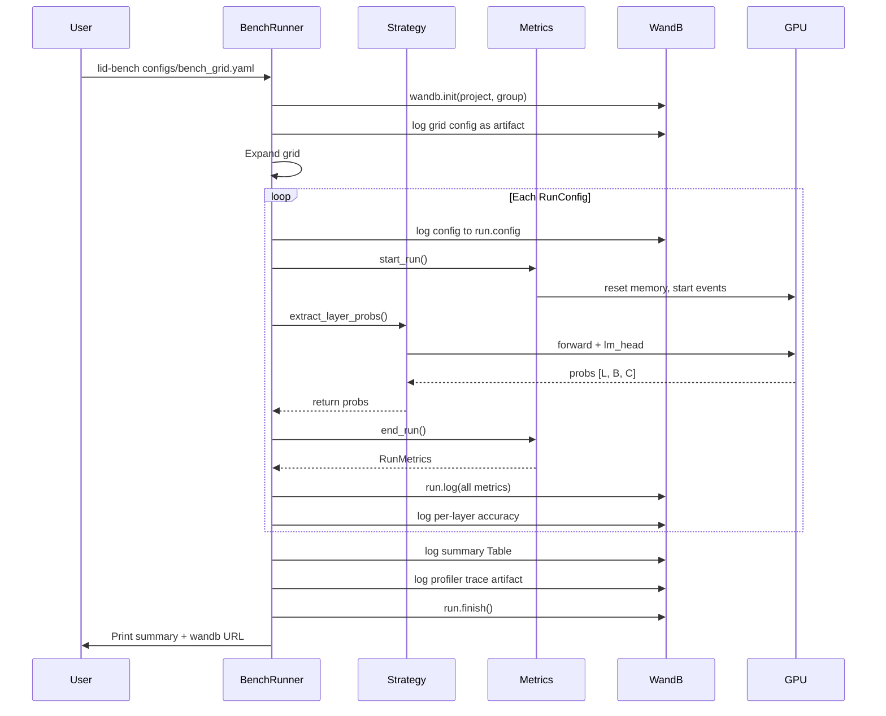
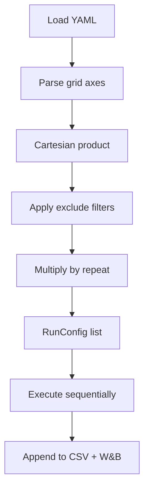

# LID Inference Pipeline Optimization, Benchmarking, and W&B Integration

> **Version:** 1.0
> **Authors:** Mayank Bhaskar
> **Date:** 2026-04-16 (status callout updated 2026-04-30)
> **Status:** Approved (and **implemented** -- the spec below
> describes the design that ships in `src/lid/bench/` today).
>
> This is the design document for the optimisation framework that
> lives in `src/lid/bench/`. It complements the research-framing
> documents:
>
> - [`proposal_original.md`](proposal_original.md) -- genesis proposal.
> - [`project_proposal.md`](project_proposal.md) -- extended proposal.
> - [`paperback.md`](paperback.md) -- forward-looking research roadmap.
>
> See [`README.md`](../README.md#project-genesis-and-document-lineage)
> for the full lineage.

---

## Table of Contents

1. [Problem Analysis](#1-problem-analysis)
2. [Architecture](#2-architecture)
3. [Optimization Strategies](#3-optimization-strategies)
4. [W&B Integration Strategy](#4-wb-integration-strategy)
5. [Metrics System](#5-metrics-system)
6. [Experiment Grid](#6-experiment-grid)
7. [Files Reference](#7-files-reference)

---

## 1. Problem Analysis

### 1.1 LID_Inference_Vibecoded -- `batched_layer_text_outputs()`

The hot path processes 37 layers x 67 classes x B samples, with thousands of
scalar `.item()` calls per batch:

```python
# CURRENT: triple-nested Python loop (~2,479 .item() calls per sample)
for b in range(batch_size):               # B
    for layer_idx in range(total_layers):  # 37
        hidden = outputs.hidden_states[layer_idx][b, last_token_idx, :]
        logits = model.lm_head(hidden)     # lm_head called B*37 = 592 times
        for opt in valid_options:           # 67
            toks = option_token_ids[opt]
            score = sum(log_probs[0, t].item() for t in toks)  # scalar
```

| Bottleneck | Severity | Root Cause |
|---|---|---|
| `lm_head` called per-sample-per-layer | Critical | `B*L = 592` tiny matmuls instead of 1 batched |
| Python `sum(log_probs[0, t].item())` | Critical | Scalar CPU round-trips inside triple loop |
| No `torch.compile` | High | Eager mode, no kernel fusion |
| Full fp16 only | Medium | ~1B model could run in int8/int4 |
| No flash attention / SDPA | Medium | Default eager attention implementation |
| `torch.cuda.empty_cache()` every 10 batches | Low | Forced cache invalidation overhead |

### 1.2 LID_Regex -- Unicode Block Distribution

```python
# CURRENT: Python character-level loop over 1.2M texts, ~40 minutes
for j, text in enumerate(batch):
    results[i+j] = Counter(blocks.of(c) for c in str(text) if c.strip())
```

| Bottleneck | Severity | Root Cause |
|---|---|---|
| `blocks.of(c)` called per-character | Critical | Pure Python, no vectorization |
| `Counter()` per text | Medium | Could batch with numpy/pandas |
| No multiprocessing | Medium | Single-threaded on 1.2M texts |

---

## 2. Architecture

### 2.1 Component Diagram



### 2.2 Execution Sequence



---

## 3. Optimization Strategies

### 3.1 Vectorized Extraction (~10x Expected)

Replaces the triple-nested Python loop with fully batched tensor operations.
This is the single biggest win.

**Before:** ``B * L * C`` scalar `.item()` calls = 592 individual `lm_head`
calls per batch of 16.

**After:** Pre-build token ID index tensors once, then zero Python loops in
the hot path:

```python
# Pre-build once
token_ids = torch.zeros(n_classes, max_tok_len, dtype=torch.long)
token_mask = torch.zeros(n_classes, max_tok_len)
for i, opt in enumerate(valid_options):
    tids = tokenizer.encode(opt, add_special_tokens=False)
    token_ids[i, :len(tids)] = torch.tensor(tids)
    token_mask[i, :len(tids)] = 1.0

# Vectorized forward
all_hidden = torch.stack(outputs.hidden_states)        # [L, B, S, D]
last_hidden = all_hidden[:, batch_range, last_idx, :]  # [L, B, D]
all_logits = model.lm_head(last_hidden) / temperature  # [L, B, V]
all_lp = torch.log_softmax(all_logits, dim=-1)         # [L, B, V]
scores = all_lp[..., token_ids] * token_mask            # [L, B, C, T]
norm_probs = torch.softmax(scores.sum(-1), dim=-1)     # [L, B, C]
```

### 3.2 `torch.compile` (1.5-2x on top of vectorized)

Compiles the model with TorchDynamo + Inductor backend for kernel fusion:

```python
compiled_model = torch.compile(model, mode="reduce-overhead")
```

- **`reduce-overhead` mode:** Uses CUDA graphs to minimize Python overhead.
  Best for repeated identical-shape inputs (our fixed-batch inference).
- **Warmup:** ~30-60s compilation on first batch; excluded from timing.
- **Precision:** Inductor may fuse attention into SDPA kernels, causing < 1e-5
  numerical differences. Accuracy unaffected for classification.

### 3.3 Quantization via bitsandbytes

```python
from transformers import BitsAndBytesConfig

# INT8: ~50% memory reduction, <1% accuracy loss typical
quant_8bit = BitsAndBytesConfig(load_in_8bit=True)

# INT4: ~75% memory reduction, potential 1-3% accuracy loss
quant_4bit = BitsAndBytesConfig(
    load_in_4bit=True,
    bnb_4bit_compute_dtype=torch.float16,
    bnb_4bit_quant_type="nf4",
)
```

### 3.4 Flash Attention / SDPA

| Backend | Flag | Requirements | Memory | Speed |
|---|---|---|---|---|
| Eager | `attn_implementation="eager"` | None | Baseline | Baseline |
| SDPA | `attn_implementation="sdpa"` | PyTorch >= 2.0 | ~40% less | ~1.5x |
| Flash Attn 2 | `attn_implementation="flash_attention_2"` | `flash-attn` | ~60% less | ~2x |

### 3.5 Combined Strategy

Compose multiple optimizations. Constraint matrix:

| | Vectorized | Compiled | Int8 | Int4 | Flash | SDPA |
|---|---|---|---|---|---|---|
| **Compiled** | Yes | - | Partial | No | Yes | Yes |
| **Int8** | Yes | Partial | - | No | Yes | Yes |
| **Int4** | Yes | No | No | - | Yes | Yes |

### 3.6 LID-Regex Optimizations

| Strategy | Expected Speedup | Approach |
|---|---|---|
| `multiprocessing.Pool` | ~4x | Parallelize across CPU cores |
| Pre-filter by `ord()` range | ~2x | Skip known ASCII via numpy |
| Combined: multiprocess + numpy | ~8-12x | Best practical approach |

---

## 4. W&B Integration Strategy

### 4.1 Project and Run Organization

```
wandb project: "lid-bench"
  |
  +-- group: "benchmark-v1"  (one group per grid YAML)
  |     |-- run: "eager_fp16_bs16_ml256_r0"
  |     |-- run: "vectorized_fp16_bs16_ml256_r0"
  |     |-- ...
  |
  +-- group: "benchmark-v2"
        |-- ...
```

Each ``RunConfig`` in the grid gets its own W&B run. Runs within the same
grid share a ``group`` tag for grouped comparison.

### 4.2 Run Config Logging

Every run logs the full ``RunConfig`` to ``wandb.config``:

```python
with wandb.init(
    project="lid-bench",
    group=grid_meta["name"],
    name=f"{strategy}_{dtype}_bs{bs}_ml{max_len}_r{repeat_idx}",
    config={
        "strategy": strategy,
        "dtype": dtype,
        "batch_size": batch_size,
        "max_length": max_length,
        "repeat_idx": repeat_idx,
        "model": model_name,
        "temperature": temperature,
        "n_samples": n_samples,
        "warmup_batches": warmup_batches,
        "seed": seed,
        "dataset": dataset_name,
    },
    tags=[strategy, dtype, f"bs{batch_size}"],
) as run:
    ...
```

### 4.3 Per-Batch Streaming Metrics

```python
run.define_metric("batch_idx")
run.define_metric("batch/*", step_metric="batch_idx")

for batch_idx, batch in enumerate(batches):
    run.log({
        "batch_idx": batch_idx,
        "batch/latency_ms": batch_latency * 1000,
        "batch/throughput_sps": batch_size / batch_latency,
        "batch/gpu_mem_mb": torch.cuda.max_memory_allocated() / 1e6,
    })
```

### 4.4 Summary Metrics

```python
run.define_metric("throughput_sps", summary="max")
run.define_metric("accuracy_last_layer", summary="max")
run.define_metric("energy_per_sample_mj", summary="min")
run.define_metric("gpu_mem_peak_mb", summary="min")
```

### 4.5 Per-Layer Accuracy Tables

```python
layer_table = wandb.Table(
    columns=["layer_idx", "accuracy", "avg_correct_prob"]
)
run.log({
    "layer_accuracy_table": layer_table,
    "layer_accuracy_curve": wandb.plot.line(
        layer_table, "layer_idx", "accuracy",
        title=f"Layer Accuracy: {strategy}"
    ),
})
```

### 4.6 Profiler Traces as Artifacts

```python
artifact = wandb.Artifact(
    name=f"profiler-trace-{run.id}",
    type="profiler-trace",
)
artifact.add_file(trace_path)
run.log_artifact(artifact)
```

### 4.7 Automatic System Metrics

W&B automatically captures every 15 seconds (no code needed):

- ``gpu.{i}.gpu`` -- GPU utilization %
- ``gpu.{i}.memory`` -- GPU memory utilization %
- ``gpu.{i}.temp`` -- Temperature C
- ``gpu.{i}.powerWatts`` -- Power draw W
- CPU %, process memory, disk I/O, network

### 4.8 Parallel Coordinates

W&B auto-generates Parallel Coordinates panels from ``run.config`` axes
vs ``run.summary`` metrics. No code needed.

### 4.9 W&B Sweeps (Optional)

The grid can alternatively be expressed as a W&B Sweep for distributed
execution across multiple machines.

---

## 5. Metrics System

### Tier 1: Wall-Clock and Throughput (every run)

| Metric | W&B Key | Unit |
|---|---|---|
| Total wall time | `total_wall_sec` | sec |
| Inference wall time | `inference_wall_sec` | sec |
| Post-processing time | `postproc_wall_sec` | sec |
| Throughput | `throughput_sps` | samples/sec |
| Latency | `latency_ms_per_sample` | ms |
| Batches/sec | `batches_per_sec` | batches/sec |

### Tier 2: GPU Hardware (every run)

| Metric | W&B Key | Unit |
|---|---|---|
| Peak GPU memory | `gpu_mem_peak_mb` | MB |
| Model memory | `gpu_mem_model_mb` | MB |
| Avg GPU power | `gpu_power_avg_w` | watts |
| Energy | `energy_joules` | J |
| Energy per sample | `energy_per_sample_mj` | mJ |
| CUDA kernel time | `cuda_kernel_time_ms` | ms |
| Host overhead | `host_overhead_ms` | ms |

### Tier 3: Model-Specific (optional, flag-gated)

| Metric | W&B Key | Unit |
|---|---|---|
| MFU | `mfu_pct` | % |
| Arithmetic intensity | `arithmetic_intensity` | FLOP/byte |
| Per-layer accuracy | `layer_accuracy_table` | Table |
| Last-layer accuracy | `accuracy_last_layer` | float |
| Same-script confusion | `same_script_confusion` | float |
| Profiler trace | `profiler-trace-{id}` | Artifact |

#### MFU Calculation

```
MFU = (2 * N_params * N_tokens) / (peak_FLOPS * wall_sec) * 100
```

For inference forward pass: ``Flops_fwd = 2 * N_params`` per token.

#### Roofline Model

```
P = min(P_peak, OI * BW_peak)
OI_decode = 2 / bytes_per_param
```

At fp16 (2 bytes): ``OI ~ 1 FLOP/byte``. Memory-bound when
``OI < peak_flops / peak_bandwidth``.

---

## 6. Experiment Grid

```yaml
meta:
  name: "lid-bench-v1"
  wandb_project: "lid-bench"
  dataset: "1024m/LID"
  dataset_file: "Data_Hackathon/LID-500.parquet"
  n_samples: 3350
  warmup_batches: 2
  repeat: 3
  seed: 1024
  profile: false

grid:
  strategy: [eager, vectorized, compiled, flash_attn, sdpa,
             quantized_int8, quantized_int4, combined]
  dtype: [fp16, bf16]
  batch_size: [4, 8, 16, 32, 64]
  max_length: [256, 512]

exclude:
  - {strategy: quantized_int4, dtype: bf16}
  - {strategy: quantized_int8, dtype: bf16}
  - {strategy: eager, batch_size: 64}

fixed:
  model: "CohereLabs/tiny-aya-global"
  temperature: 0.2
```

### Grid Expansion



---

## 7. Files Reference

| Action | Path | Description |
|---|---|---|
| Create | `src/lid/bench/__init__.py` | Subpackage exports |
| Create | `src/lid/bench/strategy.py` | ABC + registry |
| Create | `src/lid/bench/strategies/` | 6 strategy implementations |
| Create | `src/lid/bench/metrics.py` | 3-tier metrics collector |
| Create | `src/lid/bench/wandb_logger.py` | W&B logging wrapper |
| Create | `src/lid/bench/runner.py` | Grid expansion + execution |
| Create | `src/lid/bench/configs.py` | Dataclasses |
| Create | `configs/bench_grid.yaml` | Default grid |
| Create | `configs/wandb_sweep.yaml` | Optional W&B Sweep |
| Modify | `src/lid/data.py` | `load_commonlid_dataset()` |
| Modify | `pyproject.toml` | `wandb` dep + `lid-bench` CLI |
